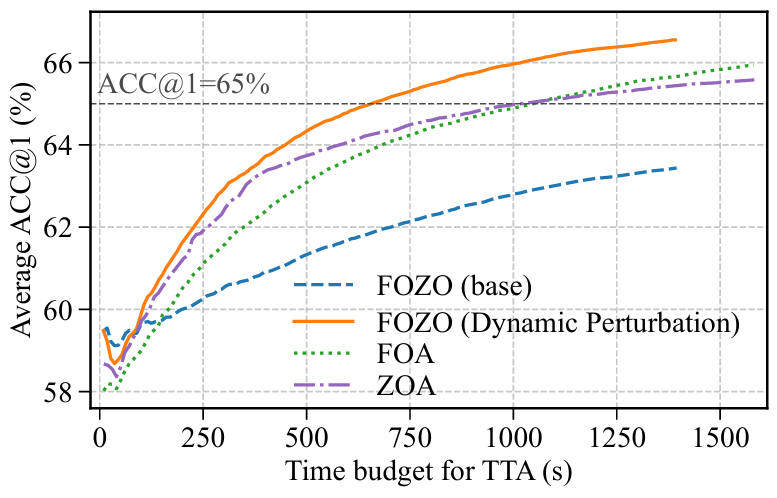

# FOZO: Forward-Only Zeroth-Order Prompt Optimization for Test-Time Adaptation (CVPR 2026)

[中文版](README_ZH.md) | [English](README.md)

本仓库是 CVPR 2026 论文 "[FOZO: Forward-Only Zeroth-Order Prompt Optimization for Test-Time Adaptation](https://arxiv.org/pdf/2603.04733)" 的官方实现。

## 🚀 简介

**FOZO** 提出了一种全新的、**无需反向传播（Backpropagation-free）** 的测试时自适应（Test-Time Adaptation, TTA）范式。

传统的 TTA 方法通常依赖反向传播来更新模型参数，这在边缘设备或量化模型上难以部署。FOZO 通过**零阶优化（Zeroth-Order Optimization）** 来优化插入模型的少量**视觉提示（Visual Prompts）**。为了解决 TTA 数据流中的不稳定性，我们引入了**动态衰减扰动机制**，并结合了**深浅层特征统计对齐**与**预测熵最小化**的无监督损失函数。

### 主要亮点：
- **纯前向推理（Forward-Only）**：完全无需计算梯度或存储中间激活值，内存开销极低。
- **动态扰动策略**：根据损失波动自动调整零阶梯度的扰动尺度 $\epsilon$ 和学习率 $\eta$。
- **强鲁棒性**：在 ImageNet-C (5K)、ImageNet-R 和 ImageNet-Sketch 上均达到 SOTA。
- **量化友好**：原生支持 INT8 量化模型（如 PTQ4ViT），解决量化模型难以更新权重的问题。
- **高效实用**：仅需 2 次前向传播即可完成自适应，适合边缘设备部署。

### 应用场景

FOZO 特别适用于以下场景：

1. **边缘设备部署**：在计算资源受限的设备上进行测试时自适应
2. **量化模型**：INT8/INT4 等低精度模型的自适应
3. **实时应用**：需要快速响应的在线学习场景
4. **跨域泛化**：模型在新的数据域上快速适应
5. **隐私保护**：无需存储中间激活值，降低隐私泄露风险

### 核心算法

FOZO 的核心思想是通过零阶优化（Simultaneous Perturbation Stochastic Approximation, SPSA）来估计梯度，从而更新可学习的视觉提示参数。算法流程如下：

1. **初始化**：在 Vision Transformer 的输入层插入少量可学习的提示（prompts）
2. **零阶梯度估计**：通过两次前向传播（正向扰动和负向扰动）估计梯度
   - $g(Z) = (l^+ - l^-) / (2 \epsilon_t)$
3. **动态调整**：根据损失变化动态调整扰动尺度 $\epsilon_t$ 和学习率 $\eta$
4. **参数更新**：使用估计的梯度更新提示参数
5. **特征对齐**：通过深浅层特征统计对齐和熵最小化优化目标函数


## 🛠️ 环境准备

建议使用 Python 3.9+ 和 PyTorch 2.0+ 环境。

```bash
# 创建并激活 conda 环境
conda env create -f environment.yml
conda activate fozo
```


## 📊 数据准备

按照以下结构准备数据集，并在 `main.py` 中通过参数（如 `--data_corruption`）指定路径：

### ImageNet（原始验证集）

用于源域统计计算和基线测试：

```bash
# 下载 ImageNet 验证集（50,000 张图像）
# 从 https://www.image-net.org/download.php 获取
# 解压到以下目录结构：
ILSVRC2012_img_val/
└── val/
    ├── n01440764/
    ├── n01443537/
    └── ...
```

### ImageNet-C

包含 15 种类型的图像损坏（噪声、模糊、天气等），每种 5 个严重等级：

- **Step 1**: 从 [ImageNet-C](https://github.com/hendrycks/robustness) 下载：[zenodo 链接](https://zenodo.org/record/2235448#.YpCSLxNBxAc)
- **Step 2**: 解压并按以下结构组织：

```
imagenet-c/
├── gaussian_noise/
│   ├── 1/
│   ├── 2/
│   ├── 3/
│   ├── 4/
│   └── 5/
├── shot_noise/
├── impulse_noise/
├── defocus_blur/
├── glass_blur/
├── motion_blur/
├── zoom_blur/
├── snow/
├── frost/
├── fog/
├── brightness/
├── contrast/
├── elastic_transform/
├── pixelate/
└── jpeg_compression/
```

### ImageNet-V2

用于测试模型在重新采样的 ImageNet 数据上的泛化能力：

- **Step 1**: 从 [ImageNet-V2](https://github.com/modestyachts/ImageNetV2) 下载：[HuggingFace 链接](https://huggingface.co/datasets/vaishaal/ImageNetV2/tree/main)
- **Step 2**: 解压 `imagenetv2-matched-frequency.tar.gz` 并组织：

```
imagenet-v2/
└── imagenetv2-matched-frequency-format-val/
    ├── 1/
    ├── 2/
    ├── 3/
    ├── 4/
    ├── 5/
    └── ...
```

### ImageNet-R

包含艺术、卡通、涂鸦等 200 个类别的 30,000 张图像：

- **Step 1**: 从 [ImageNet-R](https://github.com/hendrycks/imagenet-r) 下载：[下载链接](https://people.eecs.berkeley.edu/~hendrycks/imagenet-r.tar)
- **Step 2**: 解压 tar 文件

### ImageNet-Sketch

包含 50,000 张手绘草图：

- **Step 1**: 从 [ImageNet-Sketch](https://github.com/HaohanWang/ImageNet-Sketch) 下载：[Google Drive 链接](https://drive.google.com/file/d/1Mj0i5HBthqH1p_yeXzsg22gZduvgoNeA/view)
- **Step 2**: 解压 zip 文件

### 数据集路径配置

在运行实验前，请确保在 `main.py` 或命令行参数中正确设置数据集路径：

```bash
--data /path/to/imagenet/val              # ImageNet 原始验证集
--data_corruption /path/to/imagenet-c      # ImageNet-C
--data_rendition /path/to/imagenet-r       # ImageNet-R
--data_sketch /path/to/imagenet-sketch     # ImageNet-Sketch
--data_v2 /path/to/imagenet-v2             # ImageNet-V2
```


## 🏃 快速开始

### 基础使用

#### 1. 运行 FOZO 进行持续自适应（全精度模型）

使用默认参数在 ImageNet-C (5K) 上运行 FOZO：

```bash
python main.py \
    --algorithm fozo \
    --data /path/to/imagenet/val \
    --data_corruption /path/to/imagenet-c \
    --num_prompts 3 \
    --fitness_lambda 0.4 \
    --lr 0.08 \
    --zo_eps 0.5 \
    --batch_size 64 \
    --continual
```

#### 2. 运行无自适应基线

```bash
python main.py \
    --algorithm no_adapt \
    --data /path/to/imagenet/val \
    --data_corruption /path/to/imagenet-c
```

#### 3. 运行量化模型（INT8）上的 TTA

若要测试在量化后的模型上的表现，请添加 `--quant` 标签：

```bash
python main.py \
    --algorithm fozo \
    --quant \
    --data /path/to/imagenet/val \
    --data_corruption /path/to/imagenet-c \
    --tag _quant_experiment
```

#### 4. 使用提供的脚本运行

我们提供了一个示例脚本 `run.sh`，可以直接运行：

```bash
bash run.sh
```


## 📈 实验结果

### ImageNet-C (5K, Level 5) 性能对比

在 ImageNet-C (5K 子集，严重等级 5) 上的结果，基于 ViT-Base 模型：

| 方法 | Top-1 Acc (%) | 内存 (MiB) | FP 次数 | 运行时间 |
| :--- | :---: | :---: | :---: | :---: |
| NoAdapt | 55.57 | 819 | 1 | 94 |
| FOA | 58.13 | 831 | 2 | 224 |
| ZOA | 58.56 | 859 | 2 | 198 |
| **FOZO (Ours)** | 59.52 | 831 | 2 | 179 |

> *注：FP 代表前向传播次数。FOZO 在保持低内存的同时实现了更快的收敛速度。*

### 仅前向测试时自适应算法的收敛曲线




更快的收敛速度：在 ImageNet-C 上仅需先前方法（FOA/ZOA）所需测试时间的 66% 即可达到 相同的65%准确率。


## 📝 引用

如果你在研究中使用了本代码或参考了论文，请引用：

```bibtex
@inproceedings{fozo2026,
  title={FOZO: Forward-Only Zeroth-Order Prompt Optimization for Test-Time Adaptation},
  author={Anonymous},
  booktitle={Proceedings of the IEEE/CVF Conference on Computer Vision and Pattern Recognition (CVPR)},
  year={2026}
}
```

## 🤝 致谢

本项目的代码部分参考了以下优秀工作：

- [FOA](https://github.com/mr-eggplant/FOA) - Forward-Only Adaptation 方法
- [RobustBench](https://github.com/RobustBench/robustbench) - 标准化的鲁棒性评估基准
- [PTQ4ViT](https://github.com/bruceyo/PTQ4ViT) - Vision Transformer 量化工具
- [VPT](https://arxiv.org/abs/2203.12119) - Visual Prompt Tuning 方法